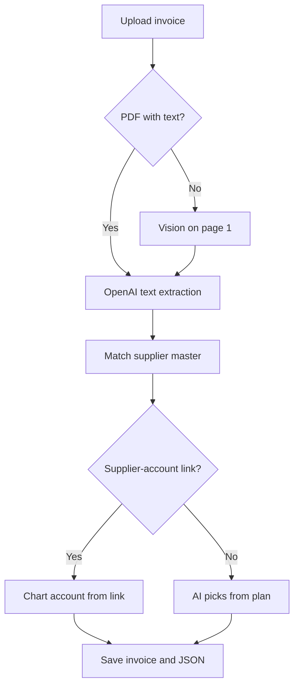
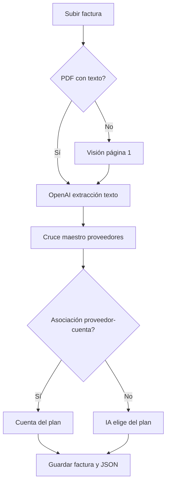

# Facturear

## English

**Facturear** is a web app to **upload Argentine supplier invoices** (PDF or photos), **extract structured data with OpenAI**, **match suppliers** against an imported master, and **assign chart-of-accounts entries** from your imported plan (cash, banks, Mercado Pago, etc.).

### Features

#### Invoices

- Upload: PDF, JPEG, PNG (max 10 MB).
- **PDF with embedded text:** `pdf-parse` → OpenAI structured extraction (Zod).
- **Scanned PDFs** (no selectable text): rasterize page 1 → OpenAI vision (same schema).
- **Images:** OpenAI vision directly.
- Storage: **Amazon S3** when `AWS_*` env vars are set; otherwise **local disk** (`.data/uploads/`) with `/api/files/...` for previews.

#### Extracted fields

- Provider name, issuer CUIT (header only), date, invoice number/type, net / VAT / total, confidence.
- **`supplier_code`** when the invoice matches your supplier master (CUIT or name prefix).
- **`chart_account_code`** and **`chart_account_name`** in the AI JSON when a chart account is resolved.

#### Account (“Cuenta”)

Only the **imported chart-of-accounts** entry is shown (not legacy auto expense categories):

1. **Supplier–account link** (if configured under Cuentas → Asociar proveedores).
2. Otherwise **OpenAI** picks a code from your imported plan (when there is a signal on the invoice).
3. Manual edit by account code on the invoice detail screen.

#### Suppliers

- **`/proveedores`** — paginated list; inline edit (name, CUIT, address, locality).
- **`/carga-proveedores`** — import CSV / XLS / XLSX (max 8 MB; up to 50k rows).
- Expected columns: **Codigo**, **Nombre**; optional CUIT, address, locality.
- On invoice processing: automatic match by issuer CUIT or company-name prefix; optional CUIT hints for the AI when the master has CUITs loaded.

#### Chart of accounts (Cuentas)

- **`/cuentas`** — paginated list of imported accounts.
- **`/carga-cuentas`** — import CSV / XLS / XLSX (columns **Cuenta**, **Nombre**, optional **Tipo**).
- Compatible with exports like `Plan de cuentas.xlsx` (e.g. EFECTIVO, MERCADO PAGO, GALICIA).
- **`/cuentas/asociar-proveedores`** — pick one account (searchable combobox), select one or many suppliers, save links; list with search and pagination (15 per page).

#### History

- **`/history`** — list with search (provider, CUIT, supplier code, account).
- **`/history/[id]`** — document preview, extracted fields table, expandable AI JSON, manual edit.

#### Auth and data

- **Auth.js / NextAuth v5** (credentials + JWT); each user sees only their own data.
- **PostgreSQL** + **Prisma**.
- Invoice statuses: `PROCESSING`, `READY`, `ERROR`, `CORRECTED`.

### Processing flow



### App routes

| Route | Description |
| ----- | ----------- |
| `/` | Landing |
| `/upload` | Upload invoice |
| `/history`, `/history/[id]` | History and detail |
| `/proveedores`, `/carga-proveedores` | Supplier master |
| `/cuentas`, `/carga-cuentas`, `/cuentas/asociar-proveedores` | Chart of accounts and supplier links |
| `/registrarse`, `/iniciar-sesion` | Register / sign in |

**Nav (logged in):** centered logo · Upload · History · Suppliers · Accounts · Sign out.

### Stack

| Layer | Technology |
| ----- | ---------- |
| App | Next.js 16, React 19, TypeScript |
| UI | Tailwind CSS v4, shadcn/ui |
| DB | PostgreSQL, Prisma ORM |
| Files | AWS S3 or local `.data/uploads` |
| Text / AI | pdf-parse, pdf-to-img (scanned PDFs), OpenAI vision + structured parse (Zod; `gpt-4o-mini` default) |
| Imports | SheetJS (`xlsx`) for CSV / Excel |

### Data model (Prisma)

- **`User`** — invoices, suppliers, chart accounts, supplier–account links.
- **`Invoice`** — file refs, OCR text, extracted columns, `supplierCode`, `chartAccountId`, `aiPayload` (JSON), status.
- **`Supplier`** — per-user master (`@@unique([userId, code])`).
- **`ChartAccount`** — per-user plan (`@@unique([userId, code])`).
- **`SupplierChartAccountLink`** — one chart account per supplier (per user).
- **`Correction`** — audit model (schema present; UI for full audit trail still pending).
- **`AccountingAccount`** — legacy global table; **not used** in the current UI or invoice flow (old `AUTO-*` rows may remain in the DB from earlier versions).

### Import formats

**Suppliers**

| Column | Required |
| ------ | -------- |
| Codigo / Código | Yes |
| Nombre / Razón social | Yes |
| CUIT, Dirección, Localidad | No |

**Chart of accounts**

| Column | Required |
| ------ | -------- |
| Cuenta / Codigo (account code) | Yes |
| Nombre | Yes |
| Tipo / Clasificación | No |

### Prerequisites

- Node.js 20+
- PostgreSQL ([Neon](https://neon.tech) or any Postgres)
- OpenAI API key (vision-capable model, e.g. `gpt-4o-mini`)
- For **S3:** bucket + IAM user with `PutObject` / `GetObject`

### Setup

```bash
cp .env.example .env
# Edit .env: DATABASE_URL, OPENAI_API_KEY, AUTH_SECRET (e.g. npm run auth:secret), AUTH_TRUST_HOST=true for local dev

npm install
npx prisma db push
npm run db:seed
npm run dev
```

Open [http://localhost:3000/](http://localhost:3000/), register at `/registrarse`, then:

1. Import chart of accounts (`/carga-cuentas`).
2. Import suppliers (`/carga-proveedores`).
3. Optionally link suppliers to accounts (`/cuentas/asociar-proveedores`).
4. Upload invoices (`/upload`).

### Scripts

| Command | Description |
| ------- | ----------- |
| `npm run dev` | Development server |
| `npm run build` | Production build |
| `npm run start` | Start production server |
| `npm run db:push` | Sync Prisma schema to DB |
| `npm run db:seed` | Seed legacy global accounting accounts; removes legacy `demo@facturear.local` if present |
| `npm run db:migrate` | Create migrations (dev) |
| `npm run auth:secret` | Print a random `AUTH_SECRET` value |

### Project layout

- `prisma/schema.prisma` — data model
- `prisma/seed.ts` — legacy `AccountingAccount` seed only
- `src/auth.ts` — Auth.js; `src/proxy.ts` — route protection
- `src/actions/invoices.ts` — upload pipeline, field updates
- `src/actions/suppliers.ts` — supplier import and CRUD
- `src/actions/chart-accounts.ts` — chart-of-accounts import
- `src/actions/supplier-chart-accounts.ts` — supplier–account associations
- `src/lib/` — db, storage, PDF/OCR, AI, Zod schemas, import parsers, matching
- `src/lib/supplier-import-parse.ts`, `chart-account-import-parse.ts`
- `src/lib/supplier-match.ts`, `supplier-chart-account.ts`, `chart-account-match.ts`
- `src/lib/chart-account-ai-hints.ts`, `association-link-search.ts`
- `src/components/chart-account-picker.tsx`, `supplier-chart-account-associate.tsx`
- `src/components/proveedores-shell.tsx`, `cuentas-shell.tsx`
- `src/app/upload`, `history`, `proveedores`, `carga-proveedores`, `cuentas`, `carga-cuentas`, `cuentas/asociar-proveedores`

### Notes

- `AUTH_SECRET` is required (see `.env.example`).
- After schema changes, run `npx prisma generate` and restart `npm run dev` if the client failed to regenerate (common on Windows when the dev server locks files).
- Scanned PDFs without embedded text are handled via vision on page 1; for best results you can also upload JPEG/PNG.

### Roadmap

**Done**

- Supplier master (import + list + edit)
- Chart of accounts (import + list)
- Supplier–account associations with search and pagination
- Invoice account field from plan (link → AI → manual edit)
- Manual correction of extracted fields
- Scanned PDF support via raster + vision

**Planned**

- Excel / CSV export
- Dashboard (VAT, spend by vendor)
- Full `Correction` audit UI
- AFIP CUIT validation, duplicate detection
- Stripe billing

---

## Español

**Facturear** es una aplicación web para **cargar facturas de proveedores argentinos** (PDF o fotos), **extraer datos con OpenAI**, **cruzar proveedores** con un maestro importado y **asignar cuentas** del plan contable que cargues (efectivo, bancos, Mercado Pago, etc.).

### Funciones

#### Facturas

- Carga: PDF, JPEG, PNG (máx. 10 MB).
- **PDF con texto embebido:** `pdf-parse` → extracción estructurada con OpenAI (Zod).
- **PDF escaneados** (sin texto seleccionable): raster de la página 1 → visión OpenAI (mismo esquema).
- **Imágenes:** visión OpenAI directa.
- Almacenamiento: **Amazon S3** si configurás `AWS_*`; si no, **disco local** (`.data/uploads/`) y vistas en `/api/files/...`.

#### Campos extraídos

- Proveedor, CUIT del emisor (solo cabecera), fecha, número/tipo de comprobante, neto / IVA / total, confianza.
- **`supplier_code`** si la factura coincide con el maestro de proveedores (CUIT o prefijo del nombre).
- **`chart_account_code`** y **`chart_account_name`** en el JSON de la IA cuando se resuelve una cuenta.

#### Cuenta

Solo se muestra la cuenta del **plan de cuentas importado** (ya no se usa “Cuenta contable” ni códigos `AUTO-*` en la interfaz):

1. **Asociación proveedor → cuenta** (si la configuraste en Cuentas → Asociar proveedores).
2. Si no hay asociación, la **IA** elige un código del plan importado (cuando hay señal en el comprobante).
3. **Edición manual** por código de cuenta en el detalle de la factura.

#### Proveedores

- **`/proveedores`** — listado paginado; edición en línea (nombre, CUIT, dirección, localidad).
- **`/carga-proveedores`** — importar CSV / XLS / XLSX (máx. 8 MB; hasta 50k filas).
- Columnas esperadas: **Codigo**, **Nombre**; CUIT, dirección y localidad opcionales.
- Al procesar facturas: cruce automático por CUIT del emisor o prefijo del nombre; la IA puede usar el maestro como referencia si hay CUITs cargados.

#### Cuentas (plan de cuentas)

- **`/cuentas`** — listado paginado de cuentas importadas.
- **`/carga-cuentas`** — importar CSV / XLS / XLSX (columnas **Cuenta**, **Nombre**, **Tipo** opcional).
- Compatible con exportaciones como `Plan de cuentas.xlsx` (EFECTIVO, MERCADO PAGO, GALICIA, etc.).
- **`/cuentas/asociar-proveedores`** — elegir una cuenta (buscador), marcar uno o varios proveedores, guardar; tabla de asociaciones con búsqueda y paginación (15 por página).

#### Historial

- **`/history`** — listado con buscador (proveedor, CUIT, código proveedor, cuenta).
- **`/history/[id]`** — vista previa del documento, tabla de campos, JSON de la IA, edición manual.

#### Cuentas de usuario y datos

- **Auth.js** (email/contraseña, JWT); cada usuario ve solo sus datos.
- **PostgreSQL** + **Prisma**.
- Estados de factura: `PROCESSING`, `READY`, `ERROR`, `CORRECTED`.

### Flujo de procesamiento



### Rutas de la aplicación

| Ruta | Descripción |
| ---- | ----------- |
| `/` | Inicio |
| `/upload` | Subir factura |
| `/history`, `/history/[id]` | Historial y detalle |
| `/proveedores`, `/carga-proveedores` | Maestro de proveedores |
| `/cuentas`, `/carga-cuentas`, `/cuentas/asociar-proveedores` | Plan de cuentas y asociaciones |
| `/registrarse`, `/iniciar-sesion` | Registro / iniciar sesión |

**Navegación (logueado):** logo centrado · Subir factura · Historial · Proveedores · Cuentas · Cerrar sesión.

### Stack

| Capa | Tecnología |
| ---- | ---------- |
| App | Next.js 16, React 19, TypeScript |
| UI | Tailwind CSS v4, shadcn/ui |
| BD | PostgreSQL, Prisma ORM |
| Archivos | AWS S3 o `.data/uploads` local |
| Texto / IA | pdf-parse, pdf-to-img (PDF escaneados), OpenAI visión + parseo Zod (`gpt-4o-mini` por defecto) |
| Importaciones | SheetJS (`xlsx`) para CSV / Excel |

### Modelo de datos (Prisma)

- **`User`** — facturas, proveedores, cuentas del plan, vínculos proveedor–cuenta.
- **`Invoice`** — archivos, texto OCR, columnas extraídas, `supplierCode`, `chartAccountId`, `aiPayload` (JSON), estado.
- **`Supplier`** — maestro por usuario (`@@unique([userId, code])`).
- **`ChartAccount`** — plan por usuario (`@@unique([userId, code])`).
- **`SupplierChartAccountLink`** — una cuenta del plan por proveedor (por usuario).
- **`Correction`** — modelo de auditoría (en esquema; UI de historial de correcciones pendiente).
- **`AccountingAccount`** — tabla global legacy; **no se usa** en la UI ni al procesar facturas hoy (pueden quedar filas `AUTO-*` viejas en la base).

### Formatos de importación

**Proveedores**

| Columna | Obligatorio |
| ------- | ----------- |
| Codigo / Código | Sí |
| Nombre / Razón social | Sí |
| CUIT, Dirección, Localidad | No |

**Plan de cuentas**

| Columna | Obligatorio |
| ------- | ----------- |
| Cuenta / Codigo | Sí |
| Nombre | Sí |
| Tipo / Clasificación | No |

### Requisitos

- Node.js 20+
- URL de PostgreSQL
- API key de OpenAI (modelo con visión, p. ej. `gpt-4o-mini`)
- Para **S3:** bucket y credenciales IAM

### Instalación

```bash
cp .env.example .env
# Completá DATABASE_URL, OPENAI_API_KEY, AUTH_SECRET (p. ej. npm run auth:secret), AUTH_TRUST_HOST=true en local

npm install
npx prisma db push
npm run db:seed
npm run dev
```

Entrá a [http://localhost:3000/](http://localhost:3000/), registrate en `/registrarse` y después:

1. Importá el plan de cuentas (`/carga-cuentas`).
2. Importá proveedores (`/carga-proveedores`).
3. Opcional: asociá proveedores a cuentas (`/cuentas/asociar-proveedores`).
4. Subí facturas (`/upload`).

### Scripts

| Comando | Descripción |
| ------- | ----------- |
| `npm run dev` | Servidor de desarrollo |
| `npm run build` | Build de producción |
| `npm run start` | Servidor en producción |
| `npm run db:push` | Sincronizar esquema Prisma |
| `npm run db:seed` | Seed legacy de cuentas contables globales; elimina `demo@facturear.local` si existía |
| `npm run db:migrate` | Crear migraciones (dev) |
| `npm run auth:secret` | Imprime un `AUTH_SECRET` aleatorio |

### Estructura del proyecto

- `prisma/schema.prisma` — modelo de datos
- `prisma/seed.ts` — solo seed legacy de `AccountingAccount`
- `src/auth.ts` — Auth.js; `src/proxy.ts` — protección de rutas
- `src/actions/invoices.ts` — pipeline de carga y actualización de campos
- `src/actions/suppliers.ts` — importación y ABM de proveedores
- `src/actions/chart-accounts.ts` — importación del plan de cuentas
- `src/actions/supplier-chart-accounts.ts` — asociaciones proveedor–cuenta
- `src/lib/` — db, storage, PDF/OCR, IA, esquemas Zod, parsers de importación, matching
- `src/lib/supplier-import-parse.ts`, `chart-account-import-parse.ts`
- `src/lib/supplier-match.ts`, `supplier-chart-account.ts`, `chart-account-match.ts`
- `src/lib/chart-account-ai-hints.ts`, `association-link-search.ts`
- `src/components/chart-account-picker.tsx`, `supplier-chart-account-associate.tsx`
- `src/components/proveedores-shell.tsx`, `cuentas-shell.tsx`
- `src/app/upload`, `history`, `proveedores`, `carga-proveedores`, `cuentas`, `carga-cuentas`, `cuentas/asociar-proveedores`

### Notas

- Necesitás `AUTH_SECRET` en `.env` (ver `.env.example`).
- Después de cambios en el esquema, ejecutá `npx prisma generate` y reiniciá `npm run dev` si el cliente no se regeneró (común en Windows con el servidor levantado).
- Los PDF escaneados sin texto se procesan con visión en la página 1; también podés subir JPEG/PNG.

### Roadmap

**Hecho**

- Maestro de proveedores (importar + listar + editar)
- Plan de cuentas (importar + listar)
- Asociación proveedor–cuenta con búsqueda y paginación
- Campo Cuenta en facturas (vínculo → IA → edición manual)
- Corrección manual de campos extraídos
- PDF escaneado vía raster + visión

**Pendiente**

- Exportación Excel / CSV
- Panel y reportes (IVA, gastos por proveedor)
- UI completa de auditoría `Correction`
- Validación AFIP, detección de duplicados
- Facturación (Stripe)
