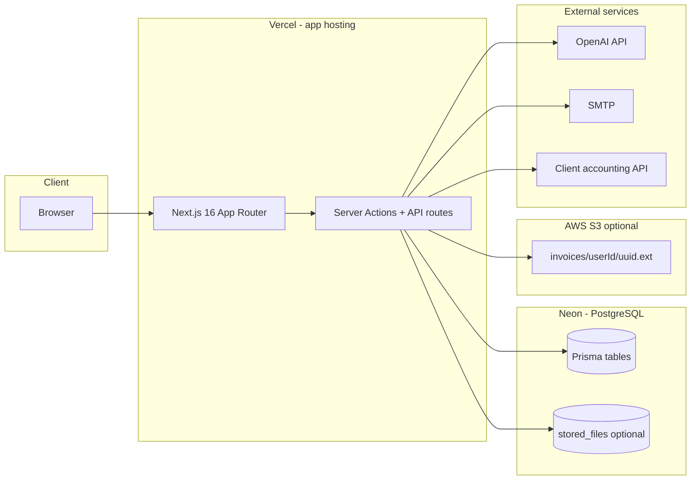
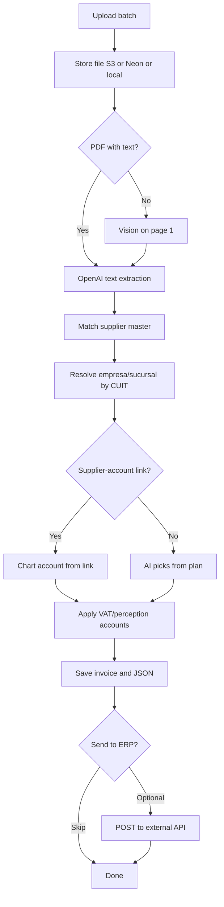
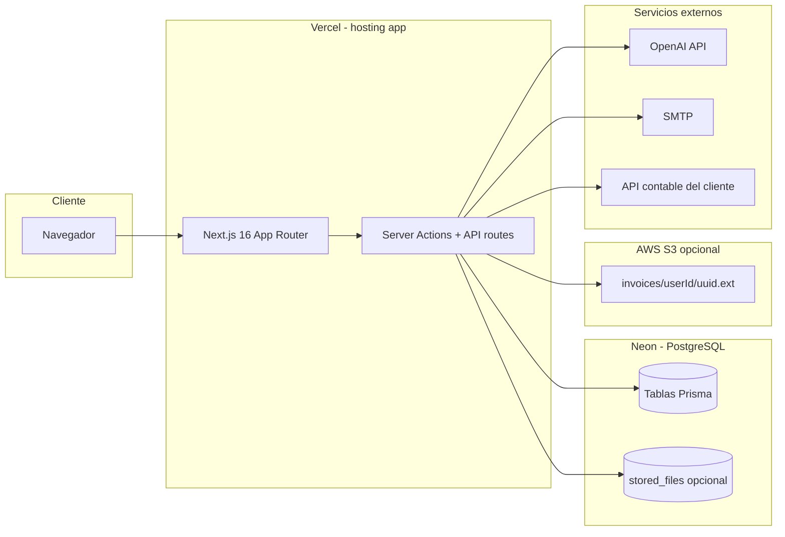
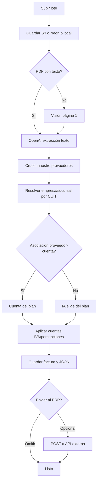

# Facturear (AgileScan)

> **Repo:** `facturear` — código fuente del producto.  
> **Producto:** **AgileScan** — nombre en la interfaz, emails y producción ([agilescan.com.ar](https://agilescan.com.ar)).

---

## English

**AgileScan** (repo: Facturear) is a web app to **upload Argentine supplier invoices** (PDF or photos), **extract structured data with OpenAI**, **match suppliers** against an imported master, **assign chart-of-accounts entries** from your imported plan, and **optionally push accounting JSON** to an external ERP/API.

### Architecture and infrastructure

Where each component runs and what it does:



| Component | Where it runs | What it stores / does | Configuration |
| --------- | ------------- | --------------------- | ------------- |
| **Web app** | **[Vercel](https://vercel.com)** (serverless) | UI, Server Actions, API routes, auth sessions (JWT) | Git deploy; env vars in Vercel dashboard |
| **Database** | **[Neon](https://neon.tech)** (PostgreSQL) | Users, invoices, suppliers, chart accounts, integration config, optional file blobs | `DATABASE_URL` → [`prisma/schema.prisma`](prisma/schema.prisma), [`src/lib/db.ts`](src/lib/db.ts) |
| **Invoice files** | **AWS S3** *or* Neon *or* local disk | Uploaded PDFs / images | [`src/lib/storage.ts`](src/lib/storage.ts) |
| **AI extraction** | **OpenAI** (external API) | Text + vision parsing of invoices | `OPENAI_API_KEY`, `OPENAI_MODEL` → [`src/lib/ai.ts`](src/lib/ai.ts) |
| **Email** | **SMTP** (operator's mail server) | Manual account activation + password reset tokens to admin | `SMTP_*`, `REGISTRATION_NOTIFY_EMAIL` → [`src/lib/email.ts`](src/lib/email.ts) |
| **Destination ERP** | **Client's API** (external, per user) | POST accounting JSON per invoice | `/api-config` → [`IntegrationConfig`](prisma/schema.prisma), [`src/actions/integration-upload.ts`](src/actions/integration-upload.ts) |

#### Production (AgileScan)

| Item | Value |
| ---- | ----- |
| **Public URL** | [https://agilescan.com.ar](https://agilescan.com.ar) (custom domain on Vercel) |
| **App host** | Vercel project linked to this Git repo |
| **Database** | Neon PostgreSQL — database name `facturear` (connection string in `DATABASE_URL`; use Neon **pooled** URL on Vercel) |
| **File storage** | AWS S3 bucket configured via Vercel env vars (`AWS_REGION`, `AWS_ACCESS_KEY_ID`, `AWS_SECRET_ACCESS_KEY`, `S3_BUCKET_NAME`) — bucket name is set in Vercel, not committed to the repo |
| **SMTP** | Mail for `@agilescan.com.ar` — `SMTP_FROM` default `AgileScan <noreply@agilescan.com.ar>`; admin notifications to `REGISTRATION_NOTIFY_EMAIL` (default `info@agilescan.com.ar`) |
| **External API** | Per-user URL + token at `/api-config`; requests use header `X-Auth-Token` (ApiSigma-style, see [`src/lib/integration-auth.ts`](src/lib/integration-auth.ts)) |

#### File storage priority

Implemented in [`src/lib/storage.ts`](src/lib/storage.ts):

1. **S3 (production recommended):** all four AWS env vars set → keys `invoices/{userId}/{uuid}.{ext}`; previews via **presigned URLs** (1 hour).
2. **Neon (Vercel without S3):** only `DATABASE_URL` → binaries in table `stored_files`; served by [`/api/files/[...key]`](src/app/api/files/[...key]/route.ts) (auth + user-scoped key check).
3. **Local dev:** `.data/uploads/` when not on Vercel and S3 is not configured.

On Vercel, if neither S3 nor `DATABASE_URL` is set, uploads fail with an explicit error listing missing variables.

### Features

#### Invoices

- **Batch upload:** up to **10 files** per batch (`BATCH_MAX_FILES` / `NEXT_PUBLIC_BATCH_MAX_FILES`; default 10). Mark “continuation of previous file” when two photos/PDFs are the same invoice → stored as multiple `InvoiceFile` parts under one `Invoice`.
- Upload: PDF, JPEG, PNG (max **10 MB** each).
- **PDF with embedded text:** `pdf-parse` → OpenAI structured extraction (Zod).
- **Scanned PDFs** (no selectable text): rasterize page 1 → OpenAI vision (same schema).
- **Images:** OpenAI vision directly.
- Storage: see [File storage priority](#file-storage-priority) above.

#### Extracted fields

- Provider name, issuer CUIT (header only), date, invoice number/type, net / VAT / perceptions / total, confidence.
- **`supplier_code`** when the invoice matches your supplier master (CUIT or name prefix).
- **`chart_account_code`** and **`chart_account_name`** in the AI JSON when a chart account is resolved.
- **`empresa`** / **`sucursal`** resolved from CUIT associations (editable on invoice detail).

#### Account (“Cuenta”)

Only the **imported chart-of-accounts** entry is shown (not legacy auto expense categories):

1. **Supplier–account link** (if configured under Cuentas → Asociar proveedores).
2. Otherwise **OpenAI** picks a code from your imported plan (when there is a signal on the invoice).
3. Manual edit by account code on the invoice detail screen.

#### Tax accounts

- **`/cuentas/asociar-impuestos`** — link one account for VAT and one or more for perceptions; used when building accounting JSON for the external API.

#### Suppliers

- **`/proveedores`** — paginated list; inline edit (name, CUIT, address, locality).
- **`/carga-proveedores`** — import CSV / XLS / XLSX (max 8 MB; up to 50k rows).
- Expected columns: **Codigo**, **Nombre**; optional CUIT, address, locality.
- On invoice processing: automatic match by issuer CUIT or company-name prefix; optional CUIT hints for the AI when the master has CUITs loaded.

#### Chart of accounts (Cuentas)

- **`/cuentas`** — paginated list of imported accounts.
- **`/carga-cuentas`** — import CSV / XLS / XLSX (columns **Cuenta**, **Nombre**, optional **Tipo**).
- Compatible with exports like `Plan de cuentas.xlsx` (e.g. EFECTIVO, MERCADO PAGO, GALICIA).
- **`/cuentas/asociar-proveedores`** — pick one account (searchable combobox), select one or many suppliers, save links; list with search and pagination (15 per page).

#### History and export

- **`/history`** — list with search (provider, CUIT, supplier code, account) and date filters.
- **`/history/[id]`** — document preview, extracted fields table, expandable AI JSON, manual edit, CUIT empresa/sucursal tabs, send to external API.
- **Export CSV / XLSX** from history toolbar → [`/api/history/export?format=csv|xlsx`](src/app/api/history/export/route.ts) (up to 5,000 rows, respects current filters).

#### External API integration

- **`/api-config`** — set destination **URL** and **user token** (stored per user in `integration_configs`).
- From invoice detail: upload accounting JSON built by [`src/lib/invoice-json.ts`](src/lib/invoice-json.ts) via [`src/actions/integration-upload.ts`](src/actions/integration-upload.ts); auth header `X-Auth-Token`.

#### Auth and data

- **Auth.js / NextAuth v5** (credentials + JWT, 7-day session); each user sees only their own data.
- **Registration:** user signs up → SMTP sends admin an approval **token** → user enters token at **`/verificar-cuenta`** → account activated (`emailVerifiedAt`).
- **Password reset:** request at **`/restablecer-contrasena`** → admin receives token by email → user confirms at **`/restablecer-contrasena/confirmar`**.
- Login blocked until email is verified. Registration requires SMTP configured on the server.
- **PostgreSQL (Neon)** + **Prisma**.
- Invoice statuses: `PROCESSING`, `READY`, `ERROR`, `CORRECTED`.
- Route guard: [`src/proxy.ts`](src/proxy.ts) (Next.js 16 auth middleware pattern; auto-protects `/upload` and `/history`; other pages check session in server components).

### Processing flow



### App routes

| Route | Description |
| ----- | ----------- |
| `/` | Landing |
| `/upload` | Batch invoice upload |
| `/history`, `/history/[id]` | History, detail, export filters |
| `/proveedores`, `/carga-proveedores` | Supplier master |
| `/cuentas`, `/carga-cuentas` | Chart of accounts |
| `/cuentas/asociar-proveedores` | Supplier–account links |
| `/cuentas/asociar-impuestos` | VAT and perception account links |
| `/api-config` | External API URL + token |
| `/registrarse`, `/iniciar-sesion` | Register / sign in |
| `/verificar-cuenta` | Enter admin approval token after registration |
| `/restablecer-contrasena`, `/restablecer-contrasena/confirmar` | Password reset flow |

**API routes**

| Route | Description |
| ----- | ----------- |
| `/api/auth/[...nextauth]` | Auth.js handlers |
| `/api/files/[...key]` | Serve files from Neon `stored_files` or local disk |
| `/api/history/export?format=csv\|xlsx` | History export (auth required) |

**Nav (logged in):** centered logo · Upload · History · Suppliers · Accounts · API · Sign out.

### Stack

| Layer | Technology |
| ----- | ---------- |
| App | Next.js 16, React 19, TypeScript |
| UI | Tailwind CSS v4, shadcn/ui |
| DB | PostgreSQL (Neon), Prisma ORM |
| Files | AWS S3, Neon `stored_files`, or local `.data/uploads` |
| Text / AI | pdf-parse, pdf-to-img (scanned PDFs), OpenAI vision + structured parse (Zod; `gpt-4o-mini` default) |
| Email | Nodemailer (SMTP) |
| Imports / export | SheetJS (`xlsx`) for CSV / Excel |

### Environment variables

Grouped by service. Template: [`.env.example`](.env.example).

| Variable | Required | Service | Purpose |
| -------- | -------- | ------- | ------- |
| `DATABASE_URL` | **Yes** | Neon | PostgreSQL connection (pooled URL on Vercel) |
| `AUTH_SECRET` | **Yes (prod)** | Vercel / Auth | JWT signing (`NEXTAUTH_SECRET` / `BETTER_AUTH_SECRET` also accepted) |
| `AUTH_TRUST_HOST` | Local dev | Auth | `true` locally; Vercel uses `trustHost: true` in code |
| `OPENAI_API_KEY` | **Yes** | OpenAI | Invoice extraction |
| `OPENAI_MODEL` | No | OpenAI | Default `gpt-4o-mini` |
| `SMTP_HOST`, `SMTP_USER`, `SMTP_PASSWORD` | **Yes for registration** | SMTP | Activation + password reset emails |
| `SMTP_PORT`, `SMTP_SECURE` | No | SMTP | Default port 587 |
| `SMTP_FROM` | No | SMTP | Default `AgileScan <noreply@agilescan.com.ar>` |
| `REGISTRATION_NOTIFY_EMAIL` | No | SMTP | Admin inbox; default `info@agilescan.com.ar` |
| `AWS_REGION`, `AWS_ACCESS_KEY_ID`, `AWS_SECRET_ACCESS_KEY` | S3 path | AWS | Invoice file storage |
| `S3_BUCKET_NAME` or `AWS_S3_BUCKET` | S3 path | AWS | Bucket name only (no `s3://` prefix) |
| `NEXT_PUBLIC_APP_URL` | Local | App | Base URL for local file previews (no trailing slash) |
| `BATCH_MAX_FILES` | No | App | Server batch limit (default 10) |
| `NEXT_PUBLIC_BATCH_MAX_FILES` | No | App | Client batch limit (default 10) |
| `VERCEL` | Auto | Vercel | Set by Vercel (`1` in production) |

**Minimum for production (Vercel + Neon):** `DATABASE_URL`, `AUTH_SECRET`, `OPENAI_API_KEY`, `SMTP_*`, plus either all four AWS vars **or** rely on Neon `stored_files` for uploads.

### Data model (Prisma)

Full schema: [`prisma/schema.prisma`](prisma/schema.prisma)

- **`User`** — auth, email verification, password reset; owns all tenant data.
- **`Invoice`** — file refs, OCR text, extracted columns, `supplierCode`, `chartAccountId`, `movementId`, `empresa`, `sucursal`, `aiPayload`, destination upload status.
- **`InvoiceFile`** — multiple file parts per invoice (batch / continuation).
- **`StoredFile`** — invoice binaries in Postgres when S3 is not used.
- **`Supplier`** — per-user master (`@@unique([userId, code])`).
- **`ChartAccount`** — per-user plan (`@@unique([userId, code])`).
- **`SupplierChartAccountLink`** — one chart account per supplier (per user).
- **`TaxChartAccountSettings`** — VAT, perception-IVA (PIV), perception-IIBB (PIB) and bonificación accounts (+ "ignore bonificaciones" flag) for JSON export.
- **`IntegrationConfig`** — external API URL + token per user.
- **`CuitEmpresa`** / **`CuitSucursal`** — empresa/sucursal options per issuer CUIT.
- **`Correction`** — audit model (schema present; full audit UI still pending).
- **`AccountingAccount`** — legacy global table; **not used** in the current UI or invoice flow.

### Import formats

**Suppliers**

| Column | Required |
| ------ | -------- |
| Codigo / Código | Yes |
| Nombre / Razón social | Yes |
| CUIT, Dirección, Localidad | No |

**Chart of accounts**

| Column | Required |
| ------ | -------- |
| Cuenta / Codigo (account code) | Yes |
| Nombre | Yes |
| Tipo / Clasificación | No |

### Prerequisites

- Node.js 20+
- PostgreSQL ([Neon](https://neon.tech) recommended)
- OpenAI API key (vision-capable model, e.g. `gpt-4o-mini`)
- SMTP server (required for registration / password reset)
- For **S3:** bucket + IAM user with `PutObject` / `GetObject`

### Local setup

```bash
cp .env.example .env
# Edit .env: DATABASE_URL, OPENAI_API_KEY, AUTH_SECRET (npm run auth:secret), AUTH_TRUST_HOST=true, SMTP_*

npm install
npm run db:push    # or: npm run db:migrate
npm run db:seed
npm run dev
```

Open [http://localhost:3000/](http://localhost:3000/), register at `/registrarse` (admin must approve via email token), then:

1. Import chart of accounts (`/carga-cuentas`).
2. Import suppliers (`/carga-proveedores`).
3. Optionally link suppliers to accounts (`/cuentas/asociar-proveedores`) and tax accounts (`/cuentas/asociar-impuestos`).
4. Optionally configure external API (`/api-config`).
5. Upload invoices (`/upload`).

### Production deploy (Vercel + Neon)

1. **Vercel:** connect this Git repo; set production domain (e.g. `agilescan.com.ar`).
2. **Neon:** create project → copy **pooled** `DATABASE_URL` into Vercel env vars.
3. **Env vars:** set minimum production list above in Vercel → Settings → Environment Variables.
4. **Storage:** configure all four AWS vars for S3, **or** use Neon-only storage (files in `stored_files`; consider DB size limits).
5. **Schema:** run against Neon from your machine or CI:
   ```bash
   DATABASE_URL="..." npx prisma db push
   # or: npx prisma migrate deploy
   ```
6. **Deploy:** Vercel runs `postinstall` → `prisma generate`, then `npm run build` (includes favicon generation).

**Ops scripts** (manual, not CI): [`scripts/apply-verification-columns.mjs`](scripts/apply-verification-columns.mjs), [`scripts/apply-password-reset-columns.mjs`](scripts/apply-password-reset-columns.mjs), [`scripts/backfill-invoice-files.ts`](scripts/backfill-invoice-files.ts).

There is **no GitHub Actions / Docker** in this repo; deploy is Vercel-native.

### Scripts

| Command | Description |
| ------- | ----------- |
| `npm run dev` | Development server |
| `npm run build` | Production build (`prisma generate` + Next.js) |
| `npm run start` | Start production server |
| `npm run db:push` | Sync Prisma schema to DB |
| `npm run db:migrate` | Create / apply migrations (dev) |
| `npm run db:seed` | Seed legacy global accounting accounts; removes legacy `demo@facturear.local` if present |
| `npm run auth:secret` | Print a random `AUTH_SECRET` value |
| `npm run icons:generate` | Regenerate favicons (runs on `prebuild`) |

### Project layout

- `prisma/schema.prisma` — data model
- `prisma/migrations/` — SQL migrations
- `prisma/seed.ts` — legacy `AccountingAccount` seed only
- `src/auth.ts` — Auth.js config
- `src/proxy.ts` — route protection (auth middleware)
- `src/actions/invoices.ts` — upload pipeline, field updates
- `src/actions/suppliers.ts` — supplier import and CRUD
- `src/actions/chart-accounts.ts` — chart-of-accounts import
- `src/actions/supplier-chart-accounts.ts` — supplier–account associations
- `src/actions/tax-chart-accounts.ts` — VAT / perception account links
- `src/actions/api-config.ts` — external API settings
- `src/actions/integration-upload.ts` — POST invoice JSON to ERP
- `src/actions/auth.ts` — register, verify, password reset
- `src/lib/` — db, storage, PDF/OCR, AI, Zod schemas, import parsers, matching, export
- `src/lib/storage.ts`, `ai.ts`, `invoice-json.ts`, `integration-auth.ts`, `history-export.ts`, `cuit-associations.ts`
- `src/components/` — UI including `site-header.tsx`, shells, forms, shadcn `ui/`
- `src/app/(auth)/` — login, register, verify, password reset
- `src/app/upload`, `history`, `proveedores`, `carga-proveedores`, `cuentas`, `carga-cuentas`, `api-config`
- `src/app/api/` — auth, files, history export
- `scripts/` — one-off maintenance scripts

### Notes

- `AUTH_SECRET` is required in production (see `.env.example`).
- After schema changes, run `npx prisma generate` and restart `npm run dev` if the client failed to regenerate (common on Windows when the dev server locks files).
- Scanned PDFs without embedded text are handled via vision on page 1; for best results you can also upload JPEG/PNG.
- On Vercel without S3, invoice files live in Neon (`stored_files`); monitor database storage and backup size.
- `AUTH_TRUST_HOST=true` is for local dev only; production relies on `trustHost: true` in [`src/auth.ts`](src/auth.ts).

### Roadmap

**Done**

- Supplier master (import + list + edit)
- Chart of accounts (import + list)
- Supplier–account and tax account associations
- Invoice account field from plan (link → AI → manual edit)
- Manual correction of extracted fields
- Scanned PDF support via raster + vision
- Batch upload (multi-file, continuation parts)
- History export CSV / XLSX
- External API integration (config + upload)
- Manual registration activation + SMTP password reset
- CUIT empresa / sucursal associations on invoice detail

**Planned**

- Dashboard (VAT, spend by vendor)
- Full `Correction` audit UI
- AFIP CUIT validation, duplicate detection
- Stripe billing

---

## Español

**AgileScan** (repositorio: Facturear) es una aplicación web para **cargar facturas de proveedores argentinos** (PDF o fotos), **extraer datos con OpenAI**, **cruzar proveedores** con un maestro importado, **asignar cuentas** del plan contable que cargues y **opcionalmente enviar JSON contable** a un ERP/API externo.

### Arquitectura e infraestructura

Dónde corre cada componente y qué hace:



| Componente | Dónde corre | Qué guarda / hace | Configuración |
| ---------- | ----------- | ----------------- | ------------- |
| **App web** | **[Vercel](https://vercel.com)** (serverless) | UI, Server Actions, API routes, sesiones JWT | Deploy desde Git; variables en el dashboard de Vercel |
| **Base de datos** | **[Neon](https://neon.tech)** (PostgreSQL) | Usuarios, facturas, proveedores, cuentas, config de integración, archivos opcionales | `DATABASE_URL` → [`prisma/schema.prisma`](prisma/schema.prisma), [`src/lib/db.ts`](src/lib/db.ts) |
| **Archivos de facturas** | **AWS S3** *o* Neon *o* disco local | PDFs e imágenes subidas | [`src/lib/storage.ts`](src/lib/storage.ts) |
| **Extracción con IA** | **OpenAI** (API externa) | Parseo texto + visión de facturas | `OPENAI_API_KEY`, `OPENAI_MODEL` → [`src/lib/ai.ts`](src/lib/ai.ts) |
| **Email** | **SMTP** (servidor del operador) | Activación manual de cuentas + tokens de reset al admin | `SMTP_*`, `REGISTRATION_NOTIFY_EMAIL` → [`src/lib/email.ts`](src/lib/email.ts) |
| **ERP destino** | **API del cliente** (externa, por usuario) | POST de JSON contable por factura | `/api-config` → [`IntegrationConfig`](prisma/schema.prisma), [`src/actions/integration-upload.ts`](src/actions/integration-upload.ts) |

#### Producción (AgileScan)

| Ítem | Valor |
| ---- | ----- |
| **URL pública** | [https://agilescan.com.ar](https://agilescan.com.ar) (dominio propio en Vercel) |
| **Hosting app** | Proyecto Vercel vinculado a este repositorio Git |
| **Base de datos** | Neon PostgreSQL — base `facturear` (connection string en `DATABASE_URL`; en Vercel usar URL **pooled** de Neon) |
| **Almacenamiento archivos** | Bucket AWS S3 vía variables en Vercel (`AWS_REGION`, `AWS_ACCESS_KEY_ID`, `AWS_SECRET_ACCESS_KEY`, `S3_BUCKET_NAME`) — el nombre del bucket no está en el repo |
| **SMTP** | Correo `@agilescan.com.ar` — `SMTP_FROM` por defecto `AgileScan <noreply@agilescan.com.ar>`; notificaciones al admin en `REGISTRATION_NOTIFY_EMAIL` (default `info@agilescan.com.ar`) |
| **API externa** | URL + token por usuario en `/api-config`; requests con header `X-Auth-Token` (estilo ApiSigma, ver [`src/lib/integration-auth.ts`](src/lib/integration-auth.ts)) |

#### Prioridad de almacenamiento de archivos

Implementado en [`src/lib/storage.ts`](src/lib/storage.ts):

1. **S3 (recomendado en producción):** las 4 variables AWS → claves `invoices/{userId}/{uuid}.{ext}`; vista previa con **URL firmada** (1 hora).
2. **Neon (Vercel sin S3):** solo `DATABASE_URL` → binarios en tabla `stored_files`; servidos por [`/api/files/[...key]`](src/app/api/files/[...key]/route.ts) (auth + control de prefijo por usuario).
3. **Desarrollo local:** `.data/uploads/` si no estás en Vercel y S3 no está configurado.

En Vercel, si no hay S3 ni `DATABASE_URL`, la subida falla con un mensaje que lista las variables faltantes.

### Funciones

#### Facturas

- **Carga por lote:** hasta **10 archivos** por lote (`BATCH_MAX_FILES` / `NEXT_PUBLIC_BATCH_MAX_FILES`; default 10). Marcá “Es continuación del archivo anterior” cuando dos fotos/PDFs son la misma factura → varias partes `InvoiceFile` bajo un mismo `Invoice`.
- Carga: PDF, JPEG, PNG (máx. **10 MB** c/u).
- **PDF con texto embebido:** `pdf-parse` → extracción estructurada con OpenAI (Zod).
- **PDF escaneados** (sin texto seleccionable): raster de la página 1 → visión OpenAI (mismo esquema).
- **Imágenes:** visión OpenAI directa.
- Almacenamiento: ver [Prioridad de almacenamiento](#prioridad-de-almacenamiento-de-archivos) arriba.

#### Campos extraídos

- Proveedor, CUIT del emisor (solo cabecera), fecha, número/tipo de comprobante, neto / IVA / percepciones / total, confianza.
- **`supplier_code`** si la factura coincide con el maestro de proveedores (CUIT o prefijo del nombre).
- **`chart_account_code`** y **`chart_account_name`** en el JSON de la IA cuando se resuelve una cuenta.
- **`empresa`** / **`sucursal`** resueltos desde asociaciones por CUIT (editables en el detalle de factura).

#### Cuenta

Solo se muestra la cuenta del **plan de cuentas importado** (ya no se usa “Cuenta contable” ni códigos `AUTO-*` en la interfaz):

1. **Asociación proveedor → cuenta** (si la configuraste en Cuentas → Asociar proveedores).
2. Si no hay asociación, la **IA** elige un código del plan importado (cuando hay señal en el comprobante).
3. **Edición manual** por código de cuenta en el detalle de la factura.

#### Cuentas de impuestos

- **`/cuentas/asociar-impuestos`** — vinculá una cuenta para IVA y una o más para percepciones; se usan al armar el JSON contable para la API externa.

#### Proveedores

- **`/proveedores`** — listado paginado; edición en línea (nombre, CUIT, dirección, localidad).
- **`/carga-proveedores`** — importar CSV / XLS / XLSX (máx. 8 MB; hasta 50k filas).
- Columnas esperadas: **Codigo**, **Nombre**; CUIT, dirección y localidad opcionales.
- Al procesar facturas: cruce automático por CUIT del emisor o prefijo del nombre; la IA puede usar el maestro como referencia si hay CUITs cargados.

#### Cuentas (plan de cuentas)

- **`/cuentas`** — listado paginado de cuentas importadas.
- **`/carga-cuentas`** — importar CSV / XLS / XLSX (columnas **Cuenta**, **Nombre**, **Tipo** opcional).
- Compatible con exportaciones como `Plan de cuentas.xlsx` (EFECTIVO, MERCADO PAGO, GALICIA, etc.).
- **`/cuentas/asociar-proveedores`** — elegir una cuenta (buscador), marcar uno o varios proveedores, guardar; tabla de asociaciones con búsqueda y paginación (15 por página).

#### Historial y exportación

- **`/history`** — listado con buscador (proveedor, CUIT, código proveedor, cuenta) y filtros por fecha.
- **`/history/[id]`** — vista previa del documento, tabla de campos, JSON de la IA, edición manual, pestañas empresa/sucursal por CUIT, envío al ERP.
- **Exportación CSV / XLSX** desde la barra del historial → [`/api/history/export?format=csv|xlsx`](src/app/api/history/export/route.ts) (hasta 5.000 filas, respeta filtros activos).

#### Integración con API externa

- **`/api-config`** — URL de destino y **token de usuario** (guardados por usuario en `integration_configs`).
- Desde el detalle de factura: subida del JSON contable generado por [`src/lib/invoice-json.ts`](src/lib/invoice-json.ts) vía [`src/actions/integration-upload.ts`](src/actions/integration-upload.ts); header `X-Auth-Token`.

#### Cuentas de usuario y datos

- **Auth.js / NextAuth v5** (email/contraseña, JWT, sesión 7 días); cada usuario ve solo sus datos.
- **Registro:** el usuario se registra → SMTP envía al admin un **token** de aprobación → el usuario lo ingresa en **`/verificar-cuenta`** → cuenta activada (`emailVerifiedAt`).
- **Restablecer contraseña:** solicitud en **`/restablecer-contrasena`** → el admin recibe token por email → confirmación en **`/restablecer-contrasena/confirmar`**.
- Login bloqueado hasta verificar email. El registro requiere SMTP configurado en el servidor.
- **PostgreSQL (Neon)** + **Prisma**.
- Estados de factura: `PROCESSING`, `READY`, `ERROR`, `CORRECTED`.
- Protección de rutas: [`src/proxy.ts`](src/proxy.ts) (middleware de auth en Next.js 16; protege `/upload` y `/history` automáticamente; el resto valida sesión en server components).

### Flujo de procesamiento



### Rutas de la aplicación

| Ruta | Descripción |
| ---- | ----------- |
| `/` | Inicio |
| `/upload` | Subir facturas (lote) |
| `/history`, `/history/[id]` | Historial, detalle, filtros de exportación |
| `/proveedores`, `/carga-proveedores` | Maestro de proveedores |
| `/cuentas`, `/carga-cuentas` | Plan de cuentas |
| `/cuentas/asociar-proveedores` | Asociaciones proveedor–cuenta |
| `/cuentas/asociar-impuestos` | Cuentas de IVA y percepciones |
| `/api-config` | URL y token de API externa |
| `/registrarse`, `/iniciar-sesion` | Registro / iniciar sesión |
| `/verificar-cuenta` | Ingresar token de aprobación del admin |
| `/restablecer-contrasena`, `/restablecer-contrasena/confirmar` | Flujo de restablecer contraseña |

**Rutas API**

| Ruta | Descripción |
| ---- | ----------- |
| `/api/auth/[...nextauth]` | Handlers de Auth.js |
| `/api/files/[...key]` | Sirve archivos desde Neon `stored_files` o disco local |
| `/api/history/export?format=csv\|xlsx` | Exportación del historial (requiere auth) |

**Navegación (logueado):** logo centrado · Subir factura · Historial · Proveedores · Cuentas · API · Cerrar sesión.

### Stack

| Capa | Tecnología |
| ---- | ---------- |
| App | Next.js 16, React 19, TypeScript |
| UI | Tailwind CSS v4, shadcn/ui |
| BD | PostgreSQL (Neon), Prisma ORM |
| Archivos | AWS S3, Neon `stored_files`, o `.data/uploads` local |
| Texto / IA | pdf-parse, pdf-to-img (PDF escaneados), OpenAI visión + parseo Zod (`gpt-4o-mini` por defecto) |
| Email | Nodemailer (SMTP) |
| Importaciones / exportación | SheetJS (`xlsx`) para CSV / Excel |

### Variables de entorno

Agrupadas por servicio. Plantilla: [`.env.example`](.env.example).

| Variable | Obligatoria | Servicio | Propósito |
| -------- | ----------- | -------- | --------- |
| `DATABASE_URL` | **Sí** | Neon | Conexión PostgreSQL (URL pooled en Vercel) |
| `AUTH_SECRET` | **Sí (prod)** | Vercel / Auth | Firma JWT (también acepta `NEXTAUTH_SECRET` / `BETTER_AUTH_SECRET`) |
| `AUTH_TRUST_HOST` | Dev local | Auth | `true` en local; en Vercel el código usa `trustHost: true` |
| `OPENAI_API_KEY` | **Sí** | OpenAI | Extracción de facturas |
| `OPENAI_MODEL` | No | OpenAI | Default `gpt-4o-mini` |
| `SMTP_HOST`, `SMTP_USER`, `SMTP_PASSWORD` | **Sí para registro** | SMTP | Emails de activación y reset |
| `SMTP_PORT`, `SMTP_SECURE` | No | SMTP | Puerto default 587 |
| `SMTP_FROM` | No | SMTP | Default `AgileScan <noreply@agilescan.com.ar>` |
| `REGISTRATION_NOTIFY_EMAIL` | No | SMTP | Bandeja del admin; default `info@agilescan.com.ar` |
| `AWS_REGION`, `AWS_ACCESS_KEY_ID`, `AWS_SECRET_ACCESS_KEY` | Ruta S3 | AWS | Almacenamiento de facturas |
| `S3_BUCKET_NAME` o `AWS_S3_BUCKET` | Ruta S3 | AWS | Solo nombre del bucket (sin prefijo `s3://`) |
| `NEXT_PUBLIC_APP_URL` | Local | App | URL base para previews locales (sin barra final) |
| `BATCH_MAX_FILES` | No | App | Límite de lote en servidor (default 10) |
| `NEXT_PUBLIC_BATCH_MAX_FILES` | No | App | Límite de lote en cliente (default 10) |
| `VERCEL` | Auto | Vercel | La setea Vercel (`1` en producción) |

**Mínimo en producción (Vercel + Neon):** `DATABASE_URL`, `AUTH_SECRET`, `OPENAI_API_KEY`, `SMTP_*`, y o bien las cuatro variables AWS **o** depender de `stored_files` en Neon para subidas.

### Modelo de datos (Prisma)

Esquema completo: [`prisma/schema.prisma`](prisma/schema.prisma)

- **`User`** — auth, verificación de email, reset de contraseña; dueño de todos los datos del tenant.
- **`Invoice`** — archivos, texto OCR, columnas extraídas, `supplierCode`, `chartAccountId`, `movementId`, `empresa`, `sucursal`, `aiPayload`, estado de subida al destino.
- **`InvoiceFile`** — varias partes de archivo por factura (lote / continuación).
- **`StoredFile`** — binarios de facturas en Postgres cuando no hay S3.
- **`Supplier`** — maestro por usuario (`@@unique([userId, code])`).
- **`ChartAccount`** — plan por usuario (`@@unique([userId, code])`).
- **`SupplierChartAccountLink`** — una cuenta del plan por proveedor (por usuario).
- **`TaxChartAccountSettings`** — cuentas de IVA, percepción IVA (PIV), percepción IIBB (PIB) y bonificación (+ flag "ignorar bonificaciones") para export JSON.
- **`IntegrationConfig`** — URL + token de API externa por usuario.
- **`CuitEmpresa`** / **`CuitSucursal`** — opciones de empresa/sucursal por CUIT emisor.
- **`Correction`** — modelo de auditoría (en esquema; UI de historial de correcciones pendiente).
- **`AccountingAccount`** — tabla global legacy; **no se usa** en la UI ni al procesar facturas hoy.

### Formatos de importación

**Proveedores**

| Columna | Obligatorio |
| ------- | ----------- |
| Codigo / Código | Sí |
| Nombre / Razón social | Sí |
| CUIT, Dirección, Localidad | No |

**Plan de cuentas**

| Columna | Obligatorio |
| ------- | ----------- |
| Cuenta / Codigo | Sí |
| Nombre | Sí |
| Tipo / Clasificación | No |

### Requisitos

- Node.js 20+
- PostgreSQL ([Neon](https://neon.tech) recomendado)
- API key de OpenAI (modelo con visión, p. ej. `gpt-4o-mini`)
- Servidor SMTP (requerido para registro / reset de contraseña)
- Para **S3:** bucket y credenciales IAM con `PutObject` / `GetObject`

### Instalación local

```bash
cp .env.example .env
# Completá DATABASE_URL, OPENAI_API_KEY, AUTH_SECRET (npm run auth:secret), AUTH_TRUST_HOST=true, SMTP_*

npm install
npm run db:push    # o: npm run db:migrate
npm run db:seed
npm run dev
```

Entrá a [http://localhost:3000/](http://localhost:3000/), registrate en `/registrarse` (el admin debe aprobar con el token del email) y después:

1. Importá el plan de cuentas (`/carga-cuentas`).
2. Importá proveedores (`/carga-proveedores`).
3. Opcional: asociá proveedores a cuentas (`/cuentas/asociar-proveedores`) e impuestos (`/cuentas/asociar-impuestos`).
4. Opcional: configurá la API externa (`/api-config`).
5. Subí facturas (`/upload`).

### Deploy en producción (Vercel + Neon)

1. **Vercel:** conectá este repo Git; configurá el dominio de producción (p. ej. `agilescan.com.ar`).
2. **Neon:** creá el proyecto → copiá la `DATABASE_URL` **pooled** a las variables de Vercel.
3. **Variables de entorno:** configurá el mínimo de producción en Vercel → Settings → Environment Variables.
4. **Almacenamiento:** las cuatro variables AWS para S3, **o** solo Neon (`stored_files`; considerá límites de tamaño de la base).
5. **Esquema:** ejecutá contra Neon desde tu máquina o CI:
   ```bash
   DATABASE_URL="..." npx prisma db push
   # o: npx prisma migrate deploy
   ```
6. **Deploy:** Vercel corre `postinstall` → `prisma generate`, luego `npm run build` (incluye generación de favicons).

**Scripts de ops** (manuales, sin CI): [`scripts/apply-verification-columns.mjs`](scripts/apply-verification-columns.mjs), [`scripts/apply-password-reset-columns.mjs`](scripts/apply-password-reset-columns.mjs), [`scripts/backfill-invoice-files.ts`](scripts/backfill-invoice-files.ts).

No hay **GitHub Actions ni Docker** en este repo; el deploy es nativo de Vercel.

### Scripts

| Comando | Descripción |
| ------- | ----------- |
| `npm run dev` | Servidor de desarrollo |
| `npm run build` | Build de producción (`prisma generate` + Next.js) |
| `npm run start` | Servidor en producción |
| `npm run db:push` | Sincronizar esquema Prisma |
| `npm run db:migrate` | Crear / aplicar migraciones (dev) |
| `npm run db:seed` | Seed legacy de cuentas contables globales; elimina `demo@facturear.local` si existía |
| `npm run auth:secret` | Imprime un `AUTH_SECRET` aleatorio |
| `npm run icons:generate` | Regenera favicons (corre en `prebuild`) |

### Estructura del proyecto

- `prisma/schema.prisma` — modelo de datos
- `prisma/migrations/` — migraciones SQL
- `prisma/seed.ts` — solo seed legacy de `AccountingAccount`
- `src/auth.ts` — configuración Auth.js
- `src/proxy.ts` — protección de rutas (middleware de auth)
- `src/actions/invoices.ts` — pipeline de carga y actualización de campos
- `src/actions/suppliers.ts` — importación y ABM de proveedores
- `src/actions/chart-accounts.ts` — importación del plan de cuentas
- `src/actions/supplier-chart-accounts.ts` — asociaciones proveedor–cuenta
- `src/actions/tax-chart-accounts.ts` — vínculos IVA / percepciones
- `src/actions/api-config.ts` — configuración API externa
- `src/actions/integration-upload.ts` — POST JSON al ERP
- `src/actions/auth.ts` — registro, verificación, reset de contraseña
- `src/lib/` — db, storage, PDF/OCR, IA, esquemas Zod, parsers, matching, exportación
- `src/lib/storage.ts`, `ai.ts`, `invoice-json.ts`, `integration-auth.ts`, `history-export.ts`, `cuit-associations.ts`
- `src/components/` — UI incluyendo `site-header.tsx`, shells, formularios, shadcn `ui/`
- `src/app/(auth)/` — login, registro, verificación, reset
- `src/app/upload`, `history`, `proveedores`, `carga-proveedores`, `cuentas`, `carga-cuentas`, `api-config`
- `src/app/api/` — auth, files, export historial
- `scripts/` — scripts de mantenimiento puntuales

### Notas

- Necesitás `AUTH_SECRET` en producción (ver `.env.example`).
- Después de cambios en el esquema, ejecutá `npx prisma generate` y reiniciá `npm run dev` si el cliente no se regeneró (común en Windows con el servidor levantado).
- Los PDF escaneados sin texto se procesan con visión en la página 1; también podés subir JPEG/PNG.
- En Vercel sin S3, los archivos viven en Neon (`stored_files`); monitoreá el tamaño de la base y backups.
- `AUTH_TRUST_HOST=true` es solo para desarrollo local; producción usa `trustHost: true` en [`src/auth.ts`](src/auth.ts).

### Roadmap

**Hecho**

- Maestro de proveedores (importar + listar + editar)
- Plan de cuentas (importar + listar)
- Asociaciones proveedor–cuenta e impuestos
- Campo Cuenta en facturas (vínculo → IA → edición manual)
- Corrección manual de campos extraídos
- PDF escaneado vía raster + visión
- Carga por lote (multi-archivo, partes de continuación)
- Exportación CSV / XLSX del historial
- Integración con API externa (config + subida)
- Activación manual de registro + reset por SMTP
- Asociaciones empresa / sucursal por CUIT en detalle de factura

**Pendiente**

- Panel y reportes (IVA, gastos por proveedor)
- UI completa de auditoría `Correction`
- Validación AFIP, detección de duplicados
- Facturación (Stripe)
